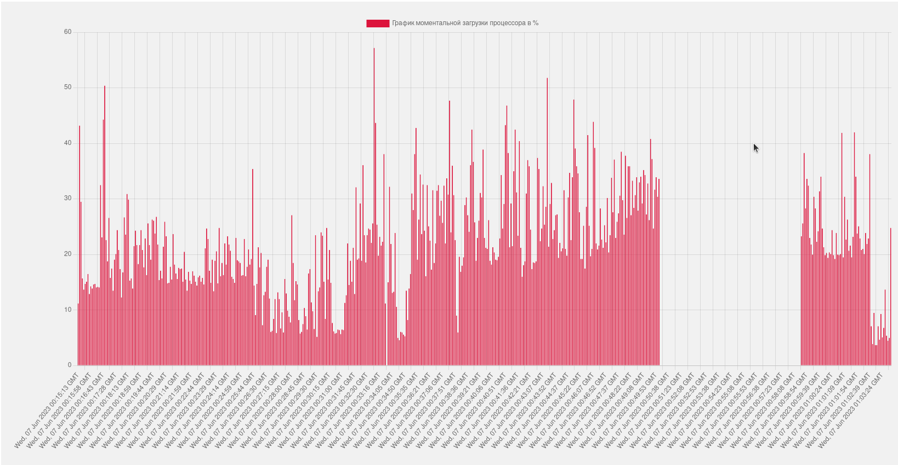
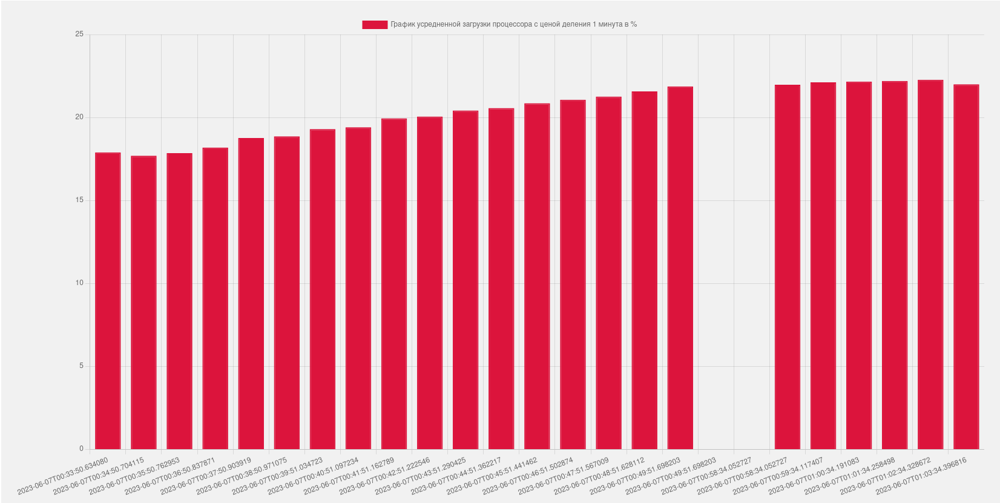

# CPU-viewer

Веб-сервис, который выполняет следующие функции:
1. Постоянно сохраняет в базу данных историю величины загрузки процессора с интервалом 5 секунд.
2. Предоставляет страницу, которая изображает срез данных с историей загрузки процессора за последний час в виде двух графиков. Первый график отображает историю изменения моментальной загрузки процессора. Второй - отображает график усредненной загрузки процессора (среднее значение за 1 минуту). В случае, если сервис на какое-то время был выключен, на графиках должны быть видны пустые промежутки времени, для которых нет данных.

В качестве базы данных можно использовать SQLite. На каком уровне рисовать графики (бэк или фронт) решает разработчик, но вычисление значений второго графика должны быть произведены в бэке.

В результате решения задания хотелось бы увидеть обоснование выбора фреймворка и принятых решений при реализации задания.

## Содержание
- [Установка](#установка)
- [Использование](#использование)
- [Пример](#пример)
- [Вывод](#вывод)

### Установка
1. Скачайте Python 3.7 или выше с сайта https://www.python.org/downloads/, затем установите его командой в терминале:
```sh
apt-get install python3 -y
```
2. Проверьте дейстующую версию python:
```sh
python3 --version
```
3. Установите виртуальное окружение в папке проекта. Нужно зайти в корень проекта и выполнить команду в терминале:
```sh
python3 -m venv env
```
4. Для активации виртуального окружения выполните команду:
```sh
source env/bin/activate
```
Слева от имени диретории в терминале должно появиться (env)

Для выхода из виртуального окружения введите команду:
```sh
deactivate
```
5. Установите Flask в вашем виртуальном окружении:
```sh
pip install Flask
```
6. Установите зависимости, используя менеджер пакетов pip и файл requirements.txt. Для этого выполните команду:
```sh
pip install -r requirements.txt
```
7. Проверьте, что зависимости установлены с помощью команды в терминале:
```sh
python3 main.py
```

### Использование
Запуск скрипта производится из корневой директории проекта командой:
```sh
python3 main.py
```
После этого веб-сервис должен быть запущен на локальном сервере и доступен по адресу http://localhost:5000.

На странице вы увидите два графика. Первый - почти моментально (5 секунд). Второй нужно будет подождать 1 минуту, пока скриптом не будут запрошены первые данные из БД.

### Пример
Ниже можно увидеть два графика с показаниями моментальной и средней загрузки процессора:

Первый график



Второй график



:heavy_exclamation_mark: Пустые промежутки на графиках означают, что скрипт не работал.

### Вывод
Для выполнении задания было принято решение использовать микрофреймворк Flask, т.к. он подходит для быстрого создания веб-приложения, используя всего один файл Python.  Для мониторинга процессора использовалась библиотека psutil. Отрисовка графиков осуществлялась при помощи библиотеки chart.js и fetch-запросов на эндпоинты для регулярного обновления данных без перезагрузки страницы.

Для сохранения истории загрузки процессора было принято решение использовать две отдельные таблицы в базе данных SQLite. Одна таблица для хранения мгновенной загрузки процессора, а другая для хранения усредненной загрузки за минуту. Для периодического сохранения данных было использовано два отдельных потока (threading), работающих в фоновом режиме.

Для решения задачи использовались потоки для непрерывной записи данных в базу данных и расчета средней загрузки процессора. Потоки оптимизированы для задач, связанных с соединением с базами данных, сетевыми запросами, вводом/выводом файлов. Благодаря использованию потоков архитектура программы легко воспринимается и понимается. Поэтому использование потоков является наиболее оптимальным и эффективным решением.


:man_technologist: Автор: [@LubimovKirill](https://github.com/LuKirill)